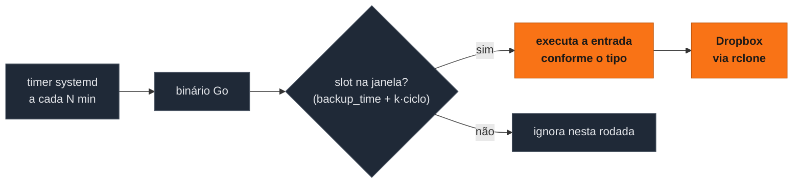

<div align="center">
<pre>
░█▀▄░█▀▄░█▀█░█▀█░█▀▄░█▀█░█░█░░░░░█▀▄░█▀▀░█░░░█▀█░█▀█░█▀▀
░█░█░█▀▄░█░█░█▀▀░█▀▄░█░█░▄▀▄░▄▄▄░█▀▄░█░░░█░░░█░█░█░█░█▀▀
░▀▀░░▀░▀░▀▀▀░▀░░░▀▀░░▀▀▀░▀░▀░░░░░▀░▀░▀▀▀░▀▀▀░▀▀▀░▀░▀░▀▀▀
</pre>
</div>

<p align="center">
  <b>Backup automatizado de pastas para o Dropbox, feito para servidores remotos sem browser.</b>
</p>

<p align="center">
  <a href="#como-funciona">Como funciona</a> ·
  <a href="#instalação">Instalação</a> ·
  <a href="#configurando-o-dropbox-servidor-sem-browser">Dropbox headless</a> ·
  <a href="#configuração-dos-backups">Backups</a> ·
  <a href="#serviço-timer-systemd">Serviço</a>
</p>

<p align="center">
  
  
  
  
</p>

---

Backup automatizado de pastas para o **Dropbox** usando [rclone](https://rclone.org), com motor de agendamento escrito em **Go**. Pensado para **servidores remotos acessados via SSH** (sem browser): um timer systemd roda o binário em intervalos fixos e ele executa os backups agendados para aquela janela.

## Por quê

- 🖥️ **Headless de verdade** — toda a configuração do Dropbox acontece via SSH, por port-forward ou por token gerado noutra máquina. Nenhuma etapa exige browser no servidor.
- 🪟 **Agendamento por janela** — o binário roda a cada *N* minutos e executa só o que está agendado para aquela janela: um timer simples cobre o dia inteiro.
- 🗜️ **Quatro tipos de backup** — arquivo compactado datado com rotação, cópia datada da pasta inteira com rotação, espelho unidirecional ou sincronização bidirecional, por entrada.
- 🧾 **JSON declarativo** — cada backup é um objeto num `backups.json` gitignorado: origem, remote, horário, retenção e tipo.
- ⌨️ **TUI para gerenciar** — listar, adicionar, editar e remover entradas sem editar JSON na mão, com formulários validados (Charm).
- 🔁 **Roda sem você** — timer systemd de usuário + linger: os backups continuam mesmo sem sessão SSH aberta.

## Como funciona

1. Um **timer systemd de usuário** dispara o binário a cada `BACKUP_INTERVAL_MINUTES` minutos (padrão: 30).
2. O binário lê o `backups.json` e seleciona as entradas com algum **slot** na janela atual — os slots do dia de cada entrada são `backup_time` + k·`repeat_cicle` (com `repeat_cicle` vazio ou `24h`, um único slot diário). Exemplo: rodando às 1h15 com intervalo de 30 min, executa os slots entre 1h00 e 1h30.
3. Cada entrada é executada conforme seu **tipo** (compactado, cópia datada da pasta, espelho ou sincronização bidirecional — ver [Tipos de backup](#tipos-de-backup)).



## Pré-requisitos

- Servidor Linux **Debian/Ubuntu/Mint**, **Arch** ou **Fedora-based**, com `sudo`.
- Uma conta Dropbox.
- Acesso SSH ao servidor.

## Instalação

```bash
git clone https://github.com/gabesan21/dropbox-rclone.git
cd dropbox-rclone

# Instala rclone e Go (detecta a distro: apt/pacman/dnf; em Debian/Ubuntu/Mint
# o Go vem do PPA longsleep/golang-backports, pois o do apt é antigo demais).
# Se já estiverem instalados, o script apenas confirma e sai.
./install.sh

# Compila o binário
go build -o dropbox-rclone .
```

## Configurando o Dropbox (servidor sem browser)

O rclone precisa de um token OAuth do Dropbox. Em servidor headless há duas rotas:

**Rota A — port-forward via SSH (recomendada):** na sua máquina local, abra um túnel para a porta de callback do rclone e rode a configuração no servidor:

```bash
# na máquina local
ssh -L 53682:localhost:53682 usuario@servidor

# no servidor, dentro da sessão SSH
rclone config
```

**Rota B — autorizar na máquina local e levar o token:** numa máquina com browser, rode `rclone authorize "dropbox"`, copie o token gerado e cole quando o `rclone config` do servidor pedir (responda `n` para "auto config").

No `rclone config`:

1. `n` — novo remote
2. nome: `dropbox` (é o `rclone_account` padrão usado no `backups.json`)
3. tipo: `dropbox`
4. conclua o OAuth por uma das rotas acima

Depois valide a conexão:

```bash
./setup-rclone.sh            # ou ./setup-rclone.sh <nome-do-remote>
```

O script lista os remotes, encontra o do tipo Dropbox e testa o acesso.

## Configuração dos backups

### `.env`

Crie o arquivo `.env` na raiz do projeto (está no `.gitignore`):

```bash
BACKUP_INTERVAL_MINUTES=30
```

Define o tamanho da janela de agendamento e o intervalo do timer systemd.

### `backups.json`

Também gitignorado. Array de objetos, um por backup:

| Campo | Tipo | Descrição |
|-------|------|-----------|
| `path` | string | Pasta local de origem (caminho absoluto). |
| `rclone_account` | string | Nome do remote rclone (ex.: `dropbox`). |
| `remote_path` | string | Pasta de destino dentro do remote (ex.: `backups/servidor/dados`). |
| `backup_time` | string | Horário do primeiro slot do dia, formato `HH:MM`. |
| `name` | string | Identificador único da entrada — obrigatório em entradas novas; é o endereço usado pelos comandos `force`/`restore`. |
| `repeat_cicle` | string | Ciclo de repetição dentro do dia: `15m`, `30m`, `1h`, `3h`, `6h`, `12h` ou `24h`. Os slots do dia são `backup_time` + k·ciclo. Vazio ou ausente equivale a `24h` (1x/dia, comportamento histórico). |
| `max_backups` | int | Máximo de backups mantidos no remoto (rotação). **Só tem efeito nos tipos `compacted` e `full-folder`**; nos demais tipos é ignorado (vale 1). |
| `type` | string | `compacted`, `full-folder`, `folder-backup` ou `folder-sync`. |

### Tipos de backup

- **`compacted`** — compacta a pasta local num `.tar.gz` datado (`<pasta>-AAAAMMDD-HHMMSS.tar.gz`) e sobe para o `remote_path`. Ao ultrapassar `max_backups` no remoto, remove os arquivos mais antigos.
- **`full-folder`** — copia a pasta local para uma pasta datada `<base>-AAAAMMDD-HHMMSS/` dentro do `remote_path` (`rclone copy`), sem compactação: cada execução preserva as versões anteriores. Ao ultrapassar `max_backups` no remoto, remove as pastas datadas mais antigas.
- **`folder-backup`** — espelha o conteúdo local no remoto com `rclone sync`: a pasta remota fica uma **cópia idêntica** da local, que é a referência (o que não existe mais localmente é removido do remoto).
- **`folder-sync`** — sincronização **bidirecional** com `rclone bisync`, respeitando as duas fontes. **Na primeira execução**, inicialize manualmente:

  ```bash
  rclone bisync /caminho/local dropbox:backups/servidor/dados --resync
  ```

Exemplo de `backups.json`:

```json
[
  {
    "path": "/home/usuario/dados",
    "rclone_account": "dropbox",
    "remote_path": "backups/servidor/dados",
    "backup_time": "02:00",
    "name": "dados-compacted",
    "repeat_cicle": "12h",
    "max_backups": 7,
    "type": "compacted"
  },
  {
    "path": "/var/www/app",
    "rclone_account": "dropbox",
    "remote_path": "backups/servidor/app",
    "backup_time": "04:00",
    "name": "app-full-folder",
    "repeat_cicle": "24h",
    "max_backups": 3,
    "type": "full-folder"
  },
  {
    "path": "/etc/nginx",
    "rclone_account": "dropbox",
    "remote_path": "backups/servidor/nginx",
    "backup_time": "03:00",
    "name": "nginx-config",
    "repeat_cicle": "24h",
    "type": "folder-backup"
  }
]
```

### Gerenciando pelo TUI

Em vez de editar o JSON na mão, use a interface de terminal:

```bash
./dropbox-rclone manage
```

Permite **listar, adicionar, editar e remover** entradas do `backups.json`, com formulários validados (nome, horário `HH:MM`, ciclo de repetição, tipo entre os quatro suportados etc.).

## Operação manual: force, restore e validate

Além do agendamento, o `service.sh` repassa três comandos ao binário:

```bash
./service.sh validate            # confere o backups.json e lista todos os problemas (exit != 0 se houver)
./service.sh force <name>        # executa a entrada <name> agora, ignorando janela e ciclo
./service.sh restore <name> --yes  # restaura a pasta local a partir do remoto
```

- **`force`** é útil para testar uma entrada sem esperar o slot. Se o nome não existir, o erro lista os nomes disponíveis.
- **`restore` é destrutivo:** o conteúdo da pasta local é **apagado e repovoado** a partir do remoto — no tipo `compacted`, extrai o `.tar.gz` mais recente; no `full-folder`, copia de volta a pasta datada mais recente; nos demais, faz `rclone sync` remoto→local. Por isso exige a flag `--yes`; sem ela, aborta sem tocar em nada.
- **`validate`** agrega todos os problemas de configuração (campos obrigatórios, `name` duplicado, `repeat_cicle` inválido ou menor que o intervalo do timer), um por linha.

## Serviço (timer systemd)

O `service.sh` cria e gerencia uma **unit + timer de systemd de usuário**, com o intervalo lido do `BACKUP_INTERVAL_MINUTES` do `.env`:

```bash
./service.sh install   # gera os units em ~/.config/systemd/user/
./service.sh enable    # install + habilita e inicia o timer
./service.sh status    # estado do timer e próxima execução
./service.sh disable   # para e desabilita o timer
./service.sh remove    # disable + apaga os units
```

Para o timer rodar mesmo **sem sessão SSH aberta**, habilite o linger (uma vez, com sudo):

```bash
sudo loginctl enable-linger "$USER"
```

Acompanhe as execuções pelos logs:

```bash
journalctl --user -u dropbox-rclone.service
```

## Teste manual

Para rodar uma verificação imediatamente (sem esperar o timer):

```bash
./dropbox-rclone
```

Ele imprime os backups da janela atual e executa cada um, reportando `OK` ou o erro de cada entrada.

## Estrutura do repositório

```
dropbox-rclone/
├── install.sh           ← instala rclone e Go (apt/pacman/dnf; Go via PPA golang-backports em Debian-based)
├── setup-rclone.sh      ← valida a conexão com o remote Dropbox
├── service.sh           ← instala/gerencia a unit + timer systemd de usuário
├── main.go              ← entry point: agendamento por janela/ciclos e subcomandos (manage, validate, force, restore)
├── backup.go            ← os quatro tipos de backup (compacted, full-folder, folder-backup, folder-sync)
├── executor.go          ← execução das entradas selecionadas, com relatório por entrada
├── restore.go           ← restore manual: rclone sync remoto→local, extração do .tar.gz ou cópia da pasta datada mais recente
├── store.go             ← leitura/escrita e validação do backups.json
├── tui.go / tui_form.go ← TUI de gerenciamento das entradas (Charm)
├── tests/               ← testes shell dos scripts de instalação, setup e serviço
└── pop/                 ← harness do ProjectOfProjects (planejamento, não faz parte do produto)
```

## Créditos

- **Desenvolvedor:** [G. S. Nunes (CariocaWeb3)](https://github.com/gabesan21).
- Transferências e remotes por **[rclone](https://rclone.org)**.
- TUI construída com o ecossistema **[Charm](https://charm.land)** (bubbletea, huh, bubbles, lipgloss).
